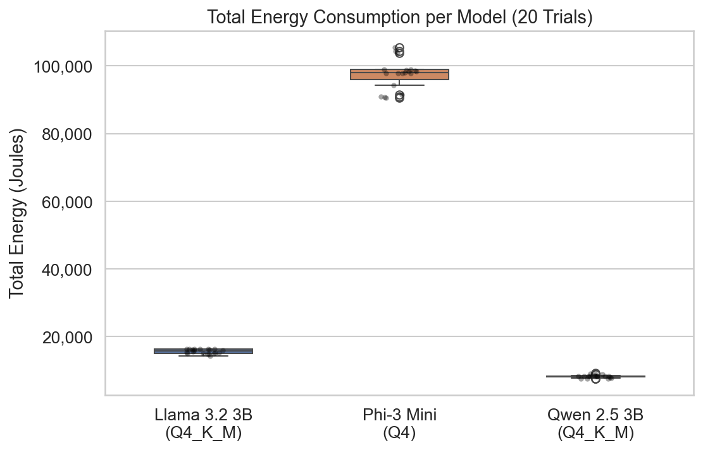
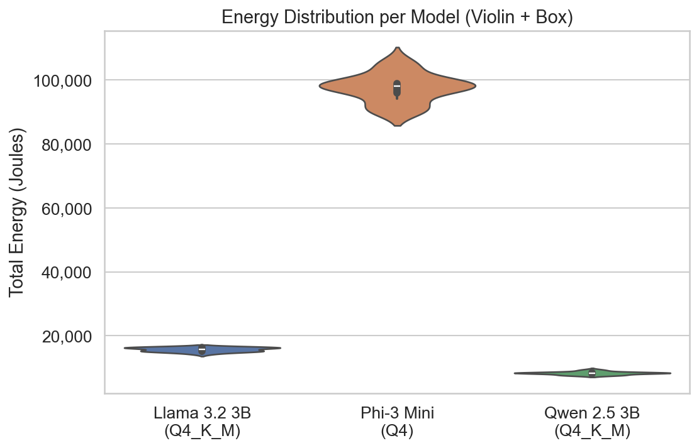
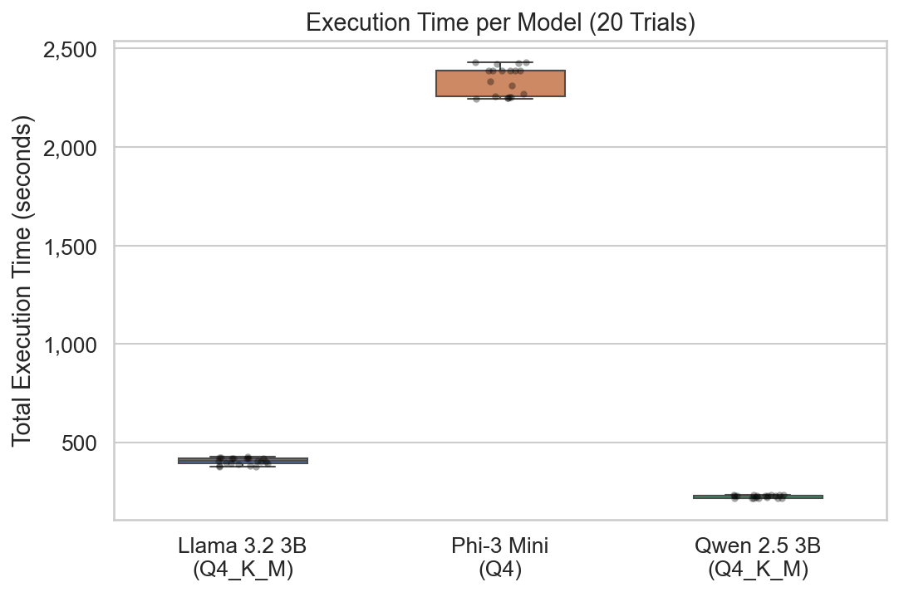
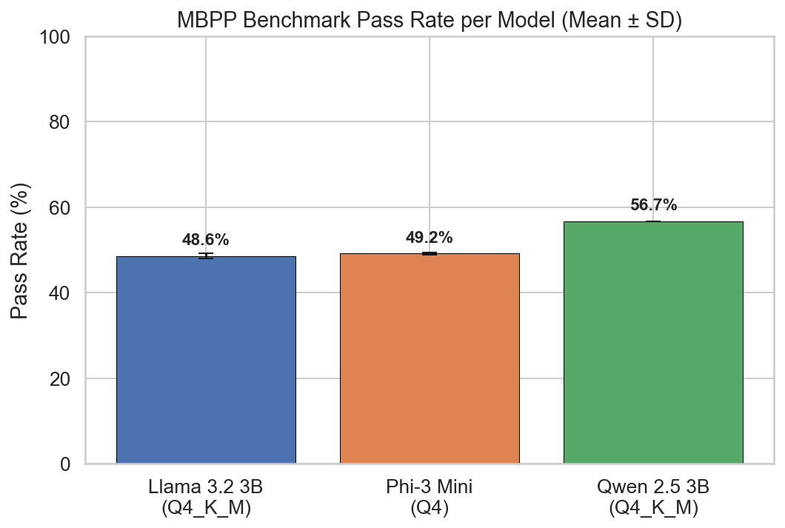
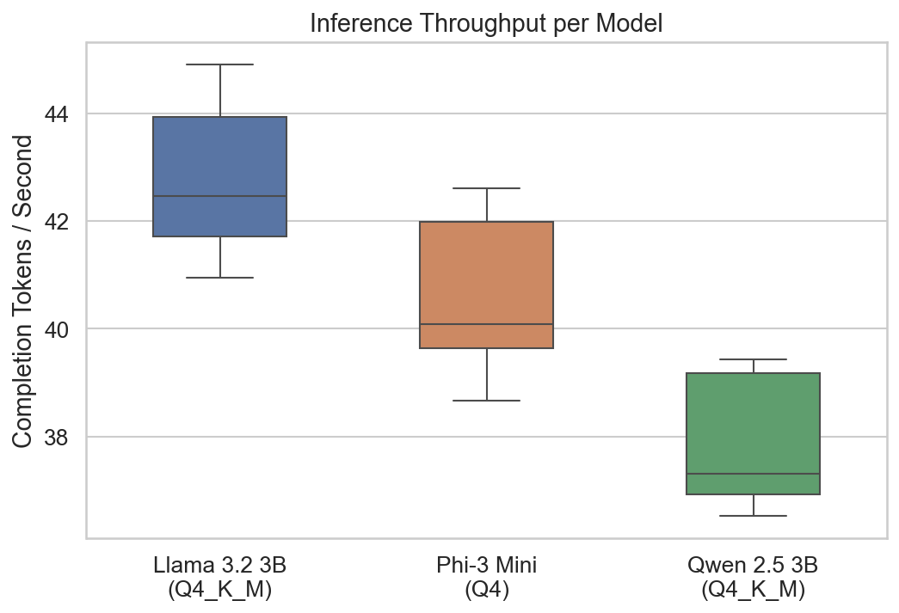
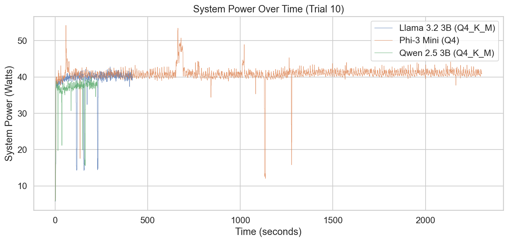
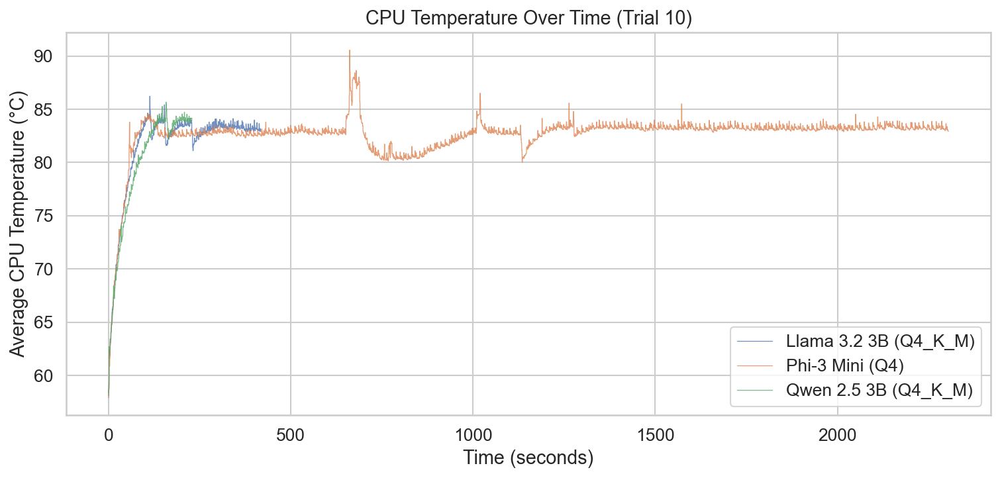
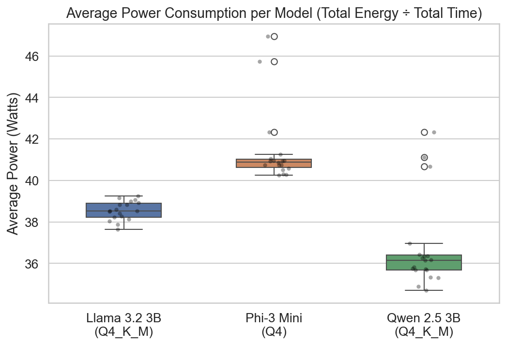
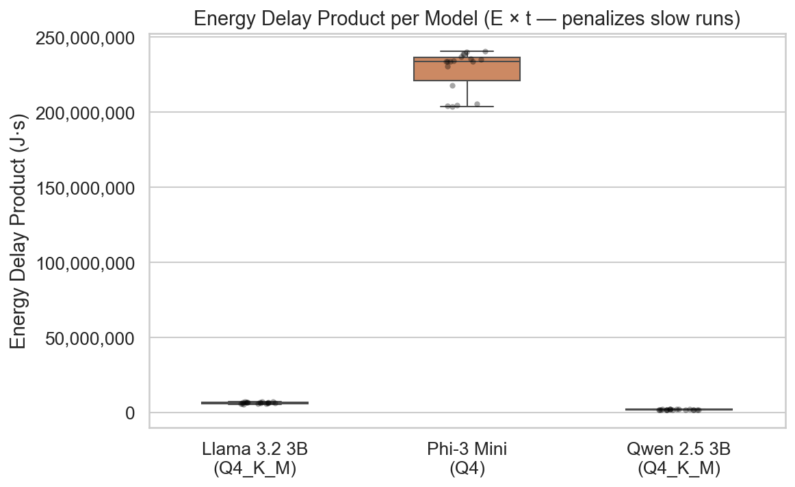

# Findings Report — Energy Efficiency of Quantized LLM Inference

## 1. Experiment Overview

We compared the energy consumption of three quantized LLM models performing code generation on the MBPP benchmark (224 tasks per trial):

| Model | Quantization | Parameters |
|-------|-------------|------------|
| **Llama 3.2 3B Instruct** | Q4_K_M (4-bit) | ~3B |
| **Phi-3 Mini 4K Instruct** | Q4 (4-bit) | ~3.8B |
| **Qwen 2.5 3B Instruct** | Q4_K_M (4-bit) | ~3B |

Each model was run for **20 trials** on the same hardware, with energy measured by EnergiBridge. The analysis applies standard statistical methods for reliable energy measurement.

---

## 2. Methodology

Our analysis pipeline follows a structured sequence of steps. Every step has a specific role: ensuring data quality, checking statistical assumptions, and producing rigorous, defensible conclusions.

### 2.1 Outlier Removal (Z-score > 3)

**What it is:** We compute z-scores within each model group and remove data points where $|z| > 3$ — i.e., values more than 3 standard deviations from the group mean.

**Why we do it:** Z-score filtering is a standard first approach to handling non-normal data. Extreme outliers can be caused by background processes, thermal throttling, or measurement errors, and they distort both means and statistical tests.

**What we found:** Outlier removal is applied to **all five analysis metrics** (Total Energy, Execution Time, Energy/Correct, Average Power, EDP), sequentially within each dataframe, so a trial removed as an outlier on one metric is already excluded before scanning the next.

- **Total Energy:** 2 outliers removed
  - Phi-3 Mini: 1 trial at 149,337 J (vs. group mean ~97,500 J — likely a system anomaly)
  - Qwen 2.5 3B: 1 trial at 15,555 J (vs. group mean ~8,300 J)
- **Energy per Correct Solution:** 3 outliers removed
  - Llama 3.2 3B: 1 trial at 66.0 J
  - Phi-3 Mini: 1 trial at 1,357.6 J
  - Qwen 2.5 3B: 1 trial at 122.5 J
- **Average Power:** 1 outlier removed
  - Llama 3.2 3B: 1 trial at 42.5 W (vs. group mean ~38.5 W)

> **Why only these 5 metrics?** Outlier removal is a preparation step for formal hypothesis testing (Shapiro-Wilk → Mann-Whitney U / Welch's t → Cohen's d). We apply it to the 5 metrics that undergo these statistical tests: Total Energy, Execution Time, Energy/Correct, Average Power, and EDP. Other metrics reported in Section 3 (pass rate, throughput, energy/token, correct solutions) are **descriptive only** — we display their means and standard deviations for context but do not run hypothesis tests on them. Since they are not statistically tested, there is no methodological need to apply the outlier removal procedure to them.

**Understanding the row counts:**

We maintain two separate dataframes, each cleaned independently:

- **Summary** (energy + time only) starts at **60 rows** — 3 models × 20 trials. The Llama trial-3 duplicate from the raw CSV is already removed during loading. Outlier removal on `Total_Joules` drops 2 rows (1 Phi, 1 Qwen); no additional outliers are found on `Total_Execution_Time_Sec` → **58 rows remain**.

- **Merged** (energy + time + eval metrics) starts at **59 rows**, not 60, because the inner join between `summary` and `eval_metrics` drops 1 trial where the eval result file is missing or doesn't match. Outlier removal then removes 4 rows across the merged-level metrics: `energy_per_correct` flags 3 outliers (1 per model), and `avg_power` flags 1 more (Llama); `edp` finds no additional outliers → **55 rows remain**.

Note that the same extreme trials tend to appear as outliers on both sides — for example, the Phi trial at 149,337 J in the summary likely corresponds to the one at 1,357.6 J/correct in merged, and the Qwen trial at 15,555 J likely corresponds to the one at 122.5 J/correct. The merged dataframe loses more rows because it has more metrics to scan and one additional trial is already absent from the join.

### 2.2 Normality Testing (Shapiro-Wilk)

**What it is:** The Shapiro-Wilk test checks whether a sample of values follows a normal (bell-curve) distribution. It returns a W statistic (0–1, where 1 = perfectly normal) and a p-value. If **p < 0.05**, we reject the assumption of normality.

**Why we do it:** This test is a **gatekeeper** — it determines which statistical comparison test we can use downstream. Parametric tests (like Welch's t-test) assume normal data and have more statistical power. Non-parametric tests (like Mann-Whitney U) make no such assumption but are less powerful. Using the wrong test can produce invalid results.

**What we found:**

| Metric | Llama 3.2 3B | Phi-3 Mini | Qwen 2.5 3B |
|--------|-------------|-----------|-------------|
| Total Energy (J) | p=0.0380 ❌ | p=0.0261 ❌ | p=0.0412 ❌ |
| Execution Time (s) | p=0.0629 ✅ | p=0.0029 ❌ | p=0.0026 ❌ |
| Energy/Correct (J) | p=0.0000 ❌ | p=0.0000 ❌ | p=0.0412 ❌ |
| EDP (J·s) | p=0.0960 ✅ | p=0.0003 ❌ | p=0.0025 ❌ |
| Avg Power (W) | p=0.8998 ✅ | p=0.0000 ❌ | p=0.0001 ❌ |

✅ = Normal (p ≥ 0.05), ❌ = Not Normal (p < 0.05)

**Interpretation:** Most groups are **not normally distributed** (12 of 15 group-metric combinations). Notably, after removing the Average Power outlier for Llama, its power distribution became clearly normal (p = 0.90). Llama's Execution Time and EDP also pass the normality test. However, since a pairwise test requires *both* groups to be normal to use Welch's t-test, and at least one group in every pair fails the normality check, we use **Mann-Whitney U** (non-parametric) for all pairwise comparisons. The non-normality is expected for LLM inference — stochastic token generation and variable completion lengths naturally produce non-normal distributions.

*Figure: Normality check — histograms with fitted normal curve for each model.*

> **How to read this plot:**
>
> Each subplot shows the distribution of measured values across ~20 trials for one model.
>
> - **X-axis:** The measured value in its original unit — **Total Energy (J)** in the top row, **Energy per Correct Solution (J)** in the bottom row.
> - **Y-axis:** **Probability Density** — the height of each bar shows how concentrated the data is in that range. It is normalized so the total area under the bars equals 1, which allows direct comparison with the theoretical curve.
> - **Bars (histogram):** Each bar represents a bin (range of values). A taller bar means more trials fell in that range.
> - **Dashed black curve:** What the distribution *would* look like if the data were perfectly normally distributed (a bell curve) with the same mean and standard deviation as the actual data.
>
> **If the bars closely follow the dashed curve**, the data is approximately normal. **If the bars are lopsided, have gaps, or pile up on one side**, the data is not normal. The Shapiro-Wilk p-value in each title formalizes this: **p ≥ 0.05 → Normal**, **p < 0.05 → Not Normal**.

### 2.3 Pairwise Statistical Tests (Mann-Whitney U)

**What it is:** For each pair of models, we test whether their distributions are significantly different. Since our data is non-normal, we use the Mann-Whitney U test — a non-parametric test that compares rank orderings rather than means.

**Why we do it:** Comparing raw averages is not enough. If Llama averages 15,680 J and Qwen averages 8,298 J, the difference *looks* large, but with only 20 trials and some variance, it could theoretically be due to chance. The Mann-Whitney U test tells us whether the difference is **statistically significant** (p < 0.05) or not.

**What we found:** All pairwise comparisons across all metrics showed **p < 0.001 (\*\*\*)**, meaning every difference is highly statistically significant. The differences between models are real, not random noise.

### 2.4 Effect Size Analysis

**What it is:** Even when a p-value confirms a difference is real, it doesn't tell us how *big* the difference is. Effect size metrics quantify the magnitude. We compute three:

- **Cohen's d** — The mean difference divided by pooled standard deviation. Measures how many "standard deviations apart" the two groups are. |d| > 0.8 = large effect.
- **Median difference (Δmedian)** — The raw difference in original units (Joules, seconds, etc.).
- **Percent change (Δ%)** — The relative difference as a percentage.

**Why we do it:** A statistically significant p-value alone is not enough — a tiny difference (e.g., 70 J vs. 69 J) can be significant with enough data, yet practically meaningless. Effect size answers whether the difference *matters*.

**What we found (Total Energy):**

| Pair | Cohen's d | Δmedian | Δ% |
|------|----------|---------|-----|
| Llama vs Phi | −26.6 (large) | +82,200 J | +521.8% |
| Llama vs Qwen | 12.8 (large) | −7,450 J | −47.1% |
| Phi vs Qwen | 28.8 (large) | −89,650 J | −91.5% |

All effect sizes are **large** (|d| >> 0.8). Phi-3 Mini consumes 522% more energy than Llama and 92% more than Qwen. These are not marginal differences — they are massive and practically significant.

---

## 3. Descriptive Statistics

Before diving into the plots, here is the numeric summary for each model (after outlier removal):

| Metric | Llama 3.2 3B | Phi-3 Mini | Qwen 2.5 3B |
|--------|-------------|-----------|-------------|
| Trials (summary / merged) | 20 / 19 | 19 / 18 | 19 / 18 |
| Total Energy (J) | 15,680 ± 661 | 97,502 ± 4,356 | 8,298 ± 468 |
| Execution Time (s) | 404.6 ± 16.9 | 2,339.9 ± 73.4 | 226.1 ± 6.9 |
| Average Power (W) | 38.5 ± 0.5 | 41.4 ± 1.8 | 36.7 ± 2.2 |
| Pass Rate (%) | 48.7 ± 0.6 | 49.2 ± 0.3 | 56.7 ± 0.0 |
| Correct Solutions | 113.3 ± 18.4 | 112.2 ± 9.2 | 127.0 ± 0.0 |
| Energy/Correct (J) | 140.9 ± 15.9 | 871.0 ± 74.3 | 65.3 ± 3.7 |
| Energy/Token (J)* | 0.89 ± 0.10 | 1.00 ± 0.08 | 0.98 ± 0.06 |
| Throughput (tok/s) | 42.7 ± 1.4 | 40.6 ± 1.3 | 37.9 ± 1.2 |
| EDP (J·s) | 6,402,531 ± 504,843 | 227,801,908 ± 13,643,209 | 1,876,575 ± 128,918 |

*\*Energy/Token is approximate — total system energy divided by total output tokens.*

**Key takeaways from the numbers:**
- **Qwen** is the most energy-efficient overall: lowest energy, fastest execution, lowest power draw, and highest accuracy.
- **Phi-3 Mini** consumes 6.2× more energy than Llama and 11.7× more than Qwen despite similar accuracy to Llama.
- **Llama** sits in the middle on energy/time but has the highest throughput (42.7 tok/s).
- All models have similar energy-per-token (~0.89–1.00 J), meaning the energy difference is primarily driven by **how many tokens each model generates** and **how long it takes**, not by per-token power efficiency.

---

## 4. Plots and Observations

### 4.1 Total Energy Consumption

**What we observe:** The three models occupy completely different energy ranges — there is zero overlap between any pair. Phi-3 Mini consumes ~97,500 J per trial (nearly 10× Llama's ~15,700 J), while Qwen uses only ~8,300 J. The within-model variance is small relative to the between-model differences, indicating highly consistent measurements.

### 4.2 Energy Distribution Shape

**What we observe:** The violin shapes reveal the distribution beyond what box plots show. Llama and Qwen have relatively compact distributions, while Phi-3 Mini shows a wider spread and slight right skew — consistent with its Shapiro-Wilk result (p = 0.026, not normal). The inner box plot shows median and IQR. Violin plots are useful for combining distribution shape with descriptive statistics in a single visualization.

### 4.3 Execution Time

**What we observe:** Phi-3 Mini takes ~2,340 seconds (~39 minutes) per trial vs. Llama's ~405 s (~6.7 min) and Qwen's ~226 s (~3.8 min). Since Energy = Power × Time, and the average power differences between models are relatively small (36.7–41.4 W), the execution time is the primary driver of energy differences. Phi-3 Mini's extreme energy consumption is largely because it takes 5.8× longer than Llama and 10.3× longer than Qwen.

### 4.4 Pass Rate (Accuracy)

**What we observe:** Llama (48.6%) and Phi-3 Mini (49.2%) achieve similar pass rates, while Qwen leads at 56.7%. Notably, Qwen's error bars are essentially zero — it produces the exact same number of correct solutions every trial (127/224), suggesting highly deterministic behavior. This means Qwen is not only the most energy-efficient but also the most accurate model, invalidating the common assumption that efficiency and quality trade off against each other.

### 4.5 Energy per Correct Solution

**What we observe:** This is the quality-normalized energy metric — it answers "how much energy does it cost to produce one correct answer?" Qwen costs only 65 J per correct solution, Llama costs 141 J, and Phi-3 Mini costs 871 J. Phi-3 Mini spends **13.3× more energy per correct answer** than Qwen. Even between Llama and Qwen (which have similar parameter counts), Qwen is 2.2× more efficient per correct answer due to both lower energy and higher accuracy.

### 4.6 Energy per Token (Approximate)

**What we observe:** Interestingly, all three models have similar energy per token (0.89–1.00 J/token). This reveals that the per-token efficiency is roughly comparable across models — the total energy differences come from how many tokens each model generates overall and how long inference takes, not from a fundamental difference in per-token energy cost. This metric is labelled "approximate" because the energy measurement covers the entire system, not just the token generation process.

### 4.7 Inference Throughput

**What we observe:** Llama has the highest throughput at 42.8 tok/s, followed by Phi-3 Mini (40.6 tok/s) and Qwen (37.9 tok/s). Despite Qwen being the fastest to complete all 224 tasks (lowest execution time), its token throughput is actually the lowest. This means Qwen generates **fewer total tokens** to arrive at correct answers — it's more concise, which contributes to its energy efficiency.

### 4.8 System Power Traces

**What we observe:** This time-series plot shows instantaneous system power (Watts) during trial 10 for each model. All three models show similar power draw patterns in the 30–50 W range, with Phi-3 Mini running for much longer. The power traces are relatively stable without major spikes, indicating no significant interference from background processes. Inspecting power traces is a standard practice to check for measurement anomalies.

### 4.9 CPU Temperature Traces

**What we observe:** CPU temperatures remain relatively stable across all models, in a similar range. This is important because thermal throttling (CPU reducing clock speed when overheating) would affect execution time and thus energy measurements. The absence of temperature spikes or runaway heating confirms that thermal effects are not confounding our results.

### 4.10 Energy vs. Pass Rate Trade-off

**What we observe:** Each dot represents one trial. The three models form distinct clusters with no overlap. Qwen occupies the ideal position: **bottom-right** (low energy, high accuracy). Phi-3 Mini is in the worst position: **top-left** (highest energy, moderate accuracy). Llama sits between them. This scatter plot makes it immediately evident that Qwen dominates on both dimensions — there is no energy-accuracy trade-off to consider.

### 4.11 Multi-Metric Summary

**What we observe:** This 4-panel overview compares mean energy, execution time, pass rate, and energy per correct solution side by side. It provides a quick "executive summary" view: Phi-3 Mini's bars tower over the others in energy and time, while Qwen leads in pass rate and has the smallest energy-per-correct bar. The visual asymmetry immediately conveys the scale of the differences.

### 4.12 Average Power

**What we observe:** Average power draw ranges from 36.7 W (Qwen) to 41.4 W (Phi-3 Mini) — a much smaller relative difference (11.4%) than the total energy difference (1,075%). This confirms that the total energy gap is **driven primarily by execution time, not power intensity**. All models draw similar wattage; the efficient ones simply finish faster. The statistically significant power difference (Mann-Whitney U, all p < 0.001) still shows Phi-3 Mini draws slightly more power, but this is a secondary factor. Notably, after outlier removal, Llama's power distribution became clearly normal (Shapiro-Wilk p = 0.90), demonstrating the effectiveness of the z-score cleaning step.

### 4.13 Energy Delay Product (EDP)

**What we observe:** EDP = Energy × Time penalizes both high energy and slow execution quadratically. Phi-3 Mini's EDP (228 million J·s) is **36× Llama's** (6.4 million J·s) and **121× Qwen's** (1.9 million J·s). The Phi vs Qwen percent change is −99.2%, meaning Qwen's EDP is less than 1% of Phi's. This composite metric, recommended by the Metrics Report, makes the inefficiency of Phi-3 Mini even more dramatic than looking at energy or time alone.

---

## 5. Summary of Statistical Findings

### All Pairwise Results — Total Energy (J)

| Pair | Test | p-value | Cohen's d | Δmedian | Δ% |
|------|------|---------|----------|---------|-----|
| Llama vs Phi | Mann-Whitney U | 1.01 × 10⁻⁷ *** | −26.6 (large) | +82,200 J | +521.8% |
| Llama vs Qwen | Mann-Whitney U | 1.01 × 10⁻⁷ *** | 12.8 (large) | −7,450 J | −47.1% |
| Phi vs Qwen | Mann-Whitney U | 1.48 × 10⁻⁷ *** | 28.8 (large) | −89,650 J | −91.5% |

### All Pairwise Results — Execution Time (s)

| Pair | Test | p-value | Cohen's d | Δmedian | Δ% |
|------|------|---------|----------|---------|-----|
| Llama vs Phi | Mann-Whitney U | 1.01 × 10⁻⁷ *** | −36.8 (large) | +1,981 s | +478.3% |
| Llama vs Qwen | Mann-Whitney U | 1.01 × 10⁻⁷ *** | 13.7 (large) | −176 s | −44.1% |
| Phi vs Qwen | Mann-Whitney U | 1.48 × 10⁻⁷ *** | 40.6 (large) | −2,157 s | −90.3% |

### All Pairwise Results — Energy per Correct Solution (J)

| Pair | Test | p-value | Cohen's d | Δmedian | Δ% |
|------|------|---------|----------|---------|-----|
| Llama vs Phi | Mann-Whitney U | 3.23 × 10⁻⁷ *** | −13.6 (large) | +743 J | +518.3% |
| Llama vs Qwen | Mann-Whitney U | 2.21 × 10⁻⁷ *** | 6.6 (large) | −81 J | −53.6% |
| Phi vs Qwen | Mann-Whitney U | 2.21 × 10⁻⁷ *** | 15.5 (large) | −824 J | −92.5% |

### All Pairwise Results — Energy Delay Product (J·s)

| Pair | Test | p-value | Cohen's d | Δmedian | Δ% |
|------|------|---------|----------|---------|-----|
| Llama vs Phi | Mann-Whitney U | 3.23 × 10⁻⁷ *** | −22.9 (large) | +227,220,074 J·s | +3,458% |
| Llama vs Qwen | Mann-Whitney U | 2.21 × 10⁻⁷ *** | 12.4 (large) | −4,547,772 J·s | −70.7% |
| Phi vs Qwen | Mann-Whitney U | 2.21 × 10⁻⁷ *** | 23.8 (large) | −231,767,846 J·s | −99.2% |

### All Pairwise Results — Average Power (W)

| Pair | Test | p-value | Cohen's d | Δmedian | Δ% |
|------|------|---------|----------|---------|-----|
| Llama vs Phi | Mann-Whitney U | 3.23 × 10⁻⁷ *** | −2.2 (large) | +2.4 W | +7.5% |
| Llama vs Qwen | Mann-Whitney U | 4.00 × 10⁻⁴ *** | 1.2 (large) | −2.4 W | −4.7% |
| Phi vs Qwen | Mann-Whitney U | 3.83 × 10⁻⁵ *** | 2.3 (large) | −4.7 W | −11.4% |

---

## 6. Conclusions

1. **Qwen 2.5 3B (Q4_K_M) is the clear winner** across all metrics — lowest energy (8,298 J), fastest execution (226 s), highest accuracy (56.7%), lowest power draw (36.7 W), and lowest energy per correct solution (65 J). It dominates on every dimension with no trade-offs.

2. **Phi-3 Mini (Q4) is dramatically less efficient** despite similar accuracy to Llama. It consumes 6.2× more energy than Llama and 11.7× more than Qwen. Its EDP is 121× worse than Qwen's. The primary driver is execution time (10.3× longer than Qwen), not power draw (only 11.4% higher).

3. **Energy differences between models are driven by speed, not power intensity.** Average power varies only 36.7–41.4 W across models, while execution time varies 226–2,340 s. Optimizing for inference speed has a much larger energy impact than reducing power draw.

4. **Energy per token is similar across models** (~0.89–1.00 J/token), suggesting that the underlying hardware utilization per token is comparable. The efficiency gap comes from how many total tokens each model generates and how quickly.

5. **All differences are statistically significant** (Mann-Whitney U, all p < 10⁻⁴) **with large effect sizes** (all Cohen's d > 1.2). These are not marginal findings — they represent substantial, practically meaningful differences in energy consumption.

6. **The data is mostly not normally distributed**, which is expected for non-deterministic AI workloads. After outlier removal, Llama's Average Power, Execution Time and EDP became normal (Shapiro-Wilk p > 0.05), but all other groups remain non-normal. We used non-parametric tests (Mann-Whitney U) throughout to handle this appropriately.
