# Energy Efficiency of Quantized LLM Inference

> **Group 7** — Sustainable Software Engineering, TU Delft
>
> Ceylin Ece · Georgios Markozanis · Kunal Narwani · Amy van der Meijden

## What This Project Does

We compare the **energy consumption** of three quantized large language models (LLMs) performing code generation on the [MBPP benchmark](https://github.com/google-research/google-research/tree/master/mbpp) (224 tasks). Each model is run for 20 trials on the same machine, with system-level energy measured by [EnergiBridge](https://github.com/tdurieux/EnergiBridge).

| Model | Quantization | Parameters | Source |
|-------|-------------|------------|--------|
| Llama 3.2 3B Instruct | Q4_K_M (4-bit) | ~3B | [bartowski/Llama-3.2-3B-Instruct-GGUF](https://huggingface.co/bartowski/Llama-3.2-3B-Instruct-GGUF) |
| Phi-3 Mini 4K Instruct | Q4 (4-bit) | ~3.8B | [microsoft/Phi-3-mini-4k-instruct-gguf](https://huggingface.co/microsoft/Phi-3-mini-4k-instruct-gguf) |
| Qwen 2.5 3B Instruct | Q4_K_M (4-bit) | ~3B | [Qwen/Qwen2.5-3B-Instruct-GGUF](https://huggingface.co/Qwen/Qwen2.5-3B-Instruct-GGUF) |

All models use 4-bit quantization and run via [llama.cpp](https://github.com/ggerganov/llama.cpp) (Python bindings: `llama-cpp-python`), using Metal GPU acceleration on Apple Silicon.

---

## Repository Structure

```
├── run_experiment.py          # Core inference script (runs one model on MBPP, logs per-task results)
├── run_trial.sh               # Wraps one trial: invokes EnergiBridge → run_experiment.py
├── run_all_trials.sh          # Orchestrates 20 trials × 3 models with 2-min cooldown between runs
├── download_models.py         # Downloads quantized GGUF models from Hugging Face
├── download_mbpp.py           # Downloads and filters the MBPP benchmark dataset
├── analyze_results.py         # Full statistical analysis + 14 plots (runs on collected results)
├── requirements.txt           # Python dependencies
├── datasets/
│   └── mbpp_test_11_to_510.jsonl   # MBPP benchmark (224 tasks, pre-downloaded)
├── results/
│   ├── total_energy_summary.csv    # Per-trial energy + time (3 models × 20 trials)
│   ├── energy/                     # EnergiBridge time-series CSVs (~200ms sampling)
│   └── eval/                       # Per-task pass/fail + token counts per trial
├── EnergiBridge/                   # EnergiBridge binary (built from source, see below)
├── plots/                          # Generated plots (14 figures, created by analyze_results.py)
├── FINDINGS_REPORT.md              # Detailed methodology & statistical findings
└── README.md
```

---

## Experiment Hardware

All experiments were conducted on a **MacBook Pro (M1 Pro, 2021)** running macOS, using Metal GPU acceleration for inference. Energy was measured at the system level via [EnergiBridge](https://github.com/tdurieux/EnergiBridge).

## Prerequisites

- **Python 3.10+**
- ~5 GB disk space for the three GGUF model files

---

## Full Setup (From Scratch)

### 1. Clone the repository

```bash
git clone https://github.com/<your-org>/sustainableSE-A1.git
cd sustainableSE-A1
```

### 2. Create and activate a Python virtual environment

```bash
python3 -m venv .venv
source .venv/bin/activate
```

### 3. Install Python dependencies

```bash
pip install -r requirements.txt
```

Key packages: `llama-cpp-python` (LLM inference via llama.cpp), `pandas`, `matplotlib`, `seaborn`, `scipy` (analysis), `huggingface_hub` (model download).

### 4. Download the MBPP dataset

The dataset is already included at `datasets/mbpp_test_11_to_510.jsonl` (224 tasks). To re-download:

```bash
python download_mbpp.py
```

### 5. Download the quantized models

```bash
python download_models.py
```

This downloads three GGUF files into `models/`:
- `Llama-3.2-3B-Instruct-Q4_K_M.gguf`
- `Phi-3-mini-4k-instruct-q4.gguf`
- `qwen2.5-3b-instruct-q4_k_m.gguf`

### 6. Build EnergiBridge

```bash
git clone https://github.com/tdurieux/EnergiBridge.git
cd EnergiBridge
cargo build --release
cd ..
```

The binary will be at `EnergiBridge/target/release/energibridge`.

---

## Running the Experiment

### Run all 20 trials for all 3 models

```bash
./run_all_trials.sh 1 20
```

This will:
1. For each trial (1–20), for each model:
   - Launch EnergiBridge to measure system energy
   - Run `run_experiment.py` which sends all 224 MBPP tasks to the model
   - Log per-task results to `results/eval/eval_results_<model>_trial_<n>.csv`
   - Log energy time-series to `results/energy/energy_results_<model>_trial_<n>.csv`
   - Append total energy + time to `results/total_energy_summary.csv`
2. Sleep 2 minutes between runs (cooldown to avoid thermal effects)

**⏱ Expected time:** ~20–40 hours total (Phi-3 Mini takes ~39 min/trial, Llama ~7 min, Qwen ~4 min).

### Run a single trial (for testing)

```bash
./run_trial.sh models/qwen2.5-3b-instruct-q4_k_m.gguf 1
```

### Important notes for reproducibility

- **Close all other applications** before running — background processes affect energy measurements
- **Disable automatic brightness**, keep screen brightness fixed
- **Prefer wired network** over Wi-Fi (or disable network if not needed)
- **Do not use the machine** during experiments
- The 2-minute cooldown between trials prevents thermal carryover

---

## Analyzing the Results

Once all trials are complete (or using the pre-collected results in `results/`):

```bash
source .venv/bin/activate
python analyze_results.py
```

### What the analysis does:

1. **Loads data** — reads `total_energy_summary.csv` + 60 eval CSVs, merges them, derives metrics (avg power, EDP, energy/correct, etc.)
2. **Removes outliers** — z-score > 3 per model group on the 5 statistically tested metrics (Total Energy, Execution Time, Energy/Correct, Avg Power, EDP)
3. **Tests normality** — Shapiro-Wilk test per model per metric (determines parametric vs. non-parametric test)
4. **Prints descriptive statistics** — mean ± std for all metrics per model
5. **Runs pairwise statistical tests** — Welch's t-test (if both groups normal) or Mann-Whitney U (otherwise), plus Cohen's d effect size and percent change
6. **Generates 14 plots** saved to `plots/`

```mermaid
flowchart TD
    classDef blue fill:#4C72B0,color:#fff,stroke:#333,stroke-width:2px
    classDef green fill:#55A868,color:#fff,stroke:#333,stroke-width:2px
    classDef orange fill:#DD8452,color:#fff,stroke:#333,stroke-width:2px
    classDef yellow fill:#fff3cd,color:#333,stroke:#856404,stroke-width:2px
    classDef gray fill:#f0f0f0,color:#333,stroke:#888,stroke-width:1px

    DATA["📂 Raw Data<br/><i>Energy CSVs · Eval CSVs · Summary CSV</i>"]:::blue

    LOAD["⚙️ Load & Merge<br/><i>Join energy + eval data per trial</i>"]:::gray

    DERIVE["🧮 Derive Metrics<br/><i>avg power · energy/token · EDP<br/>pass rate · energy/correct</i>"]:::gray

    OUTLIER["🧹 Remove Outliers<br/><i>Z-score &gt; 3 per model group<br/>on ALL metrics</i>"]:::green

    SHAPIRO{"📊 Shapiro-Wilk<br/>Normal?"}:::yellow

    WELCH["Welch's t-test<br/><i>parametric</i>"]:::green
    MANN["Mann-Whitney U<br/><i>non-parametric</i>"]:::green

    EFFECT["📏 Effect Size<br/><i>Cohen's d · % change · Δ median</i>"]:::green

    PLOTS["📈 14 Plots<br/><i>Box · Violin · Bar · Scatter<br/>Traces · Histograms</i>"]:::orange

    DATA --> LOAD --> DERIVE --> OUTLIER --> SHAPIRO
    SHAPIRO -- "p ≥ 0.05 → Normal" --> WELCH
    SHAPIRO -- "p < 0.05 → Not Normal" --> MANN
    WELCH & MANN --> EFFECT --> PLOTS
```



### What to expect as output

```
[1/6] Loading data...
  Summary: 60 rows  |  Eval: 13949 rows  |  Merged: 59 rows

[2/6] Checking for outliers...
  Total Energy (J): removed 2 outlier(s)
  Energy/Correct (J): removed 3 outlier(s)
  Average Power (W): removed 1 outlier(s)

[3/6] Normality testing...
  (Shapiro-Wilk results per model per metric)

[4/6] Computing descriptive statistics...
  (Mean ± std for each model)

[5/6] Running statistical tests...
  (Pairwise Mann-Whitney U + Cohen's d for 5 metrics × 3 pairs)

[6/6] Generating plots...
  ✓ energy_boxplot.png
  ✓ time_boxplot.png
  ... (14 plots total)
```

To save the full output to a file:

```bash
python analyze_results.py | tee analysis_output.txt
```

### Generated plots

| # | File | What it shows |
|---|------|--------------|
| 1 | `energy_boxplot.png` | Total energy per model (box + individual trials) |
| 2 | `time_boxplot.png` | Execution time per model |
| 3 | `pass_rate_bar.png` | MBPP pass rate (accuracy) |
| 4 | `energy_violin.png` | Energy distribution shape |
| 5 | `energy_per_token_approx.png` | Energy per generated token |
| 6 | `energy_per_correct.png` | Energy per correct solution |
| 7 | `throughput_boxplot.png` | Tokens per second |
| 8 | `power_traces.png` | System power over time (trial 10) |
| 9 | `cpu_temp_traces.png` | CPU temperature over time (trial 10) |
| 10 | `energy_vs_passrate.png` | Energy vs. accuracy scatter |
| 11 | `combined_summary.png` | 4-panel overview |
| 12 | `avg_power_boxplot.png` | Average power draw |
| 13 | `edp_boxplot.png` | Energy Delay Product |
| 14 | `normality_histograms.png` | Normality check with fitted curves |

---

## Key Findings

- **Qwen 2.5 3B** is the clear winner: lowest energy (8,298 J), fastest (226 s), highest accuracy (56.7%), lowest EDP
- **Phi-3 Mini** consumes **11.7× more energy** than Qwen despite similar accuracy — primarily because it takes 10.3× longer
- Energy differences are driven by **speed, not power intensity** (all models draw 36.7–41.4 W)
- All differences are statistically significant (Mann-Whitney U, p < 10⁻⁴) with large effect sizes (Cohen's d > 1.2)

See [FINDINGS_REPORT.md](FINDINGS_REPORT.md) for the full methodology and results.